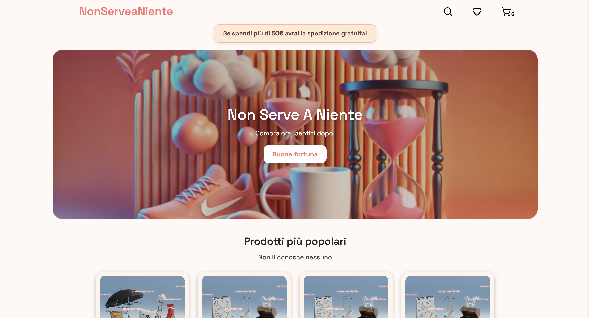
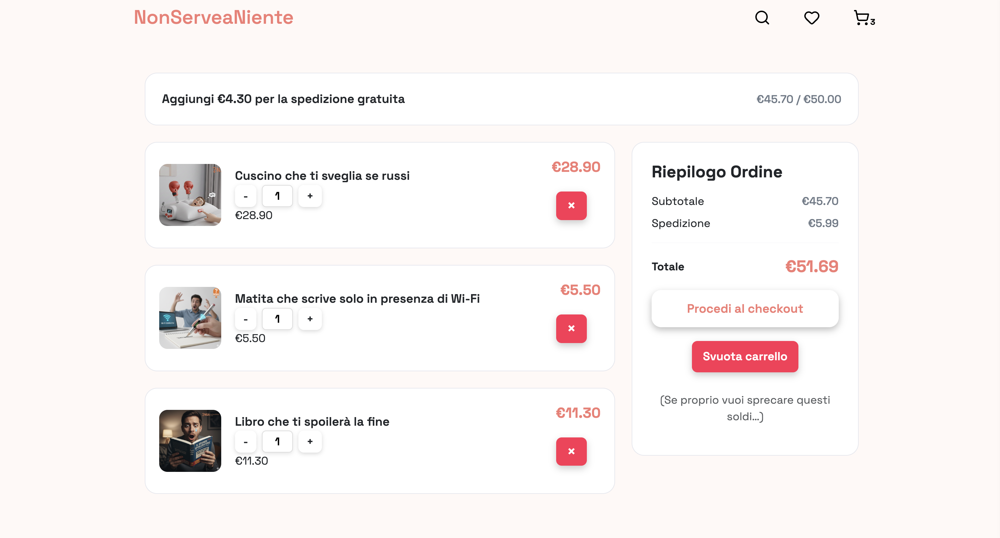
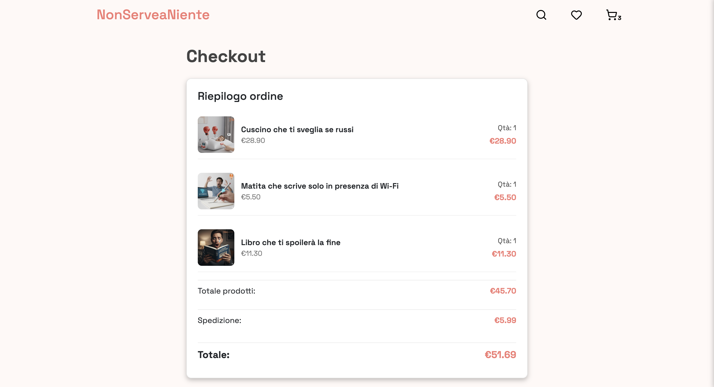
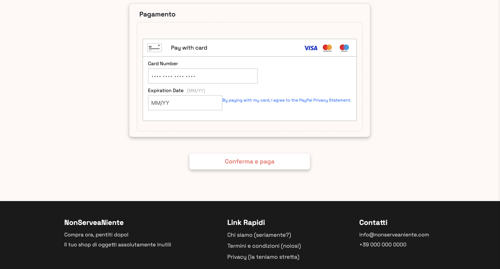

# NonServeaNiente – E-commerce React (Team Project)

> E-commerce SPA sviluppato in team. Io ho contribuito principalmente alla gestione dello stato globale, logica carrello e debugging.

## 🔧 Il mio contributo
- Context API: Cart, Wishlist, Notification, API
- Logica carrello (add/update qty, limiti, validazioni)

- Persistenza con localStorage
- Fix bug: loop in useEffect e richieste duplicate
- Filtri sincronizzati con URL (query string)

## ⚙️ Stack
- React, Vite, React Router
- Context API
- REST API, Async/Await
- Bootstrap / CSS
- Braintree (pagamenti)

## ✨ Features
- Carrello persistente
- Wishlist
- Filtri con URL condivisibile
- Checkout con pagamento
- UI responsive

## Homepage
## 📸 Screenshots

| Homepage | Cart |
|---------|------|
|  |  |

| Checkout | Payment |
|----------|---------|
|  |  |

## 🧠 Note
Progetto sviluppato in team. Ho lavorato su specifiche parti (state management, cart, debugging).
